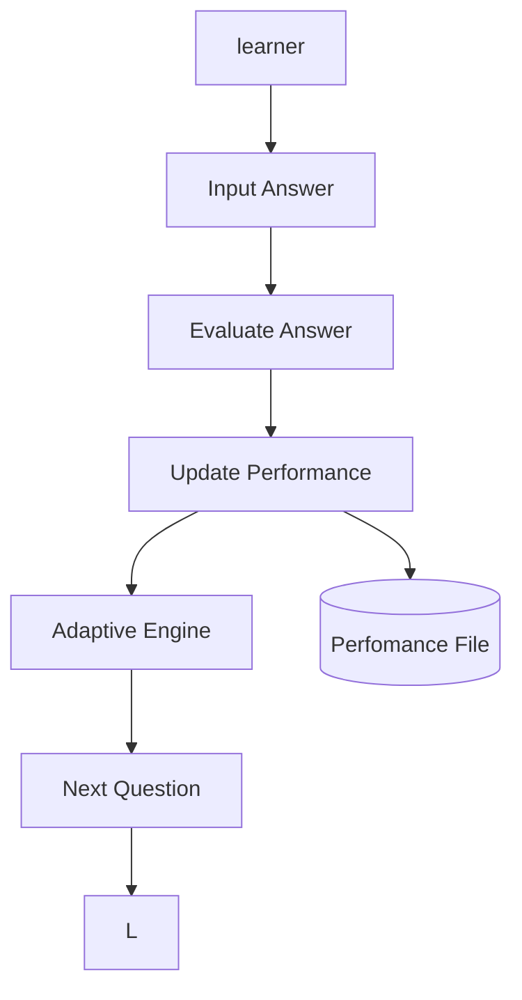

# MWALIMU RULE BASED INTELLIGENCE
## Data Flow Diagram
It is a visual representation that shows how data moves through a system.

```mermaid
flowchart TD
    Learner[learner] -->I[Input Answer]
    I--> E[Evaluate Answer]
    E--> P[Update Performance]
    P--> A[Adaptive Engine]
    A--> Q[Next Question]
    Q-->L

    P-->F[(Perfomance File)]
```